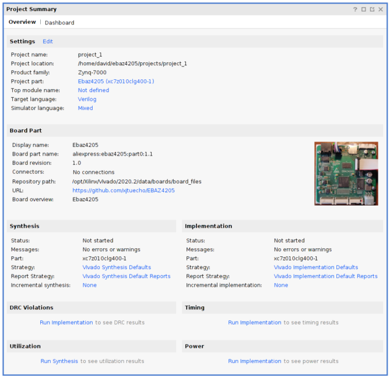

# Board definition files

a new pre-defined board 'Ebaz4205' to select the processor type and some i/o desinitions. Copy into <base>/Xilinx/Vivado/2020.2/data/boards
[ebaz4205 board files](./ebaz4205)

A new board preset to automatically configure the i/o devices and memory parts. apply in ps7 block configuration screen.
[ebaz-4207-preset.tct](./ebaz4205-ps7-preset.tcl)

