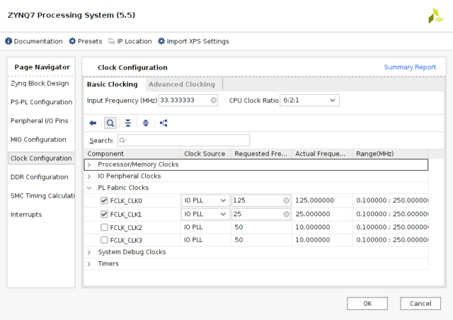

# Clock Options

## Ethernet Clock

The Ethernet phi U24 needs a 25MHz oscillator. SOme boards have a crystal Y3 and associated components fitted for this purpose. Later boards do not have these parts populated on the board but instead use a frequency output from the Zynq for this purpose. 

### PS7 Fabric Clock

Fabric clock 0 is configured by default in the nand application to 125 MHz, Fabric clock1 which is used by the ethernet phi is configured to 25MHz. The settings are shown in the screenshot.

The application supplied in nand memory has a fabric clock1 configured for this purpose output to PS clock pin U18. This can be recreated in Vivado.




### Constraint

```
# Ethernet Clock
set_property IOSTANDARD LVCMOS33 [get_ports ETHERNET_CLOCK]
set_property PACKAGE_PIN U18 [get_ports ETHERNET_CLOCK]
```

## PS clock

The ebaz4205 does have the PL clock oscillator components fitted, designs can function using the Zynq PS7 clocks instead if needed.

An alternative is to either filt the missing clock oscillator components or to feed in an existing clock.

Here I am sharing the 33MHz PL clock oscillator withthe PL clock input pin.

I use this for quick and dirty PL only applications which do not need the Zynq processing system adding into a block design. The PS is not used at all this way.

### Circuit modification

The photo shows a fine wire soldered from R2340 the clock output from X8 feeding into the PL clock input on the pad for the missing R1372 near X5.


### Constraint
```
\# 33.333 MHz Clock definition
set_property PACKAGE_PIN N18 [get_ports sys_clock]
set_property IOSTANDARD LVCMOS33 [get_ports sys_clock]
create_clock -name sys_clk -period 30.00 [get_ports {sys_clock}];   
```

