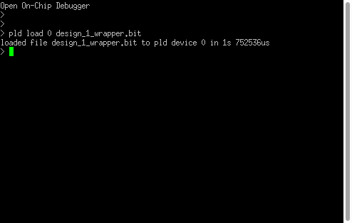

# EBAZ4205 jtag

Using a clone Platform Cable USB Model DLC9LP bbased on FTDI FT232H device with openocd jtag communication software.

The configuration files are adapted from the ones in this Git repo [M-Labs/zynq-rs](https://git.m-labs.hk/M-Labs/zynq-rs)

Be sure to check the USB vid and pid in the config file, Ive had a bit of trouble with my device forgetting its settings, the ones in the config match my device unless I reprogram the FTDI chip.

|   downloads                      |
|--------------------------------------|
|[ebaz-4205.cfg](ebaz-4205.cfgL)     |
|[zynq-7000.cfg](zynq-7000.cfg)       |
|[digilent-hs2.cfg](digilent-hs2.cfgL)|
|[design_1_wrapper.bit](design_1_wrapper.bit)|

A basic connection to the USB  cable is made with the command 'openocd -f ebaz-4205.cfg' a connection to the zync will then be attempted and stus displayed at the console

```
david@I7MINT:~/Documents/GitHub/djrm-EBAZ4205/jtag$ openocd -f ebaz-4205.cfg
Open On-Chip Debugger 0.10.0
Licensed under GNU GPL v2
For bug reports, read
	http://openocd.org/doc/doxygen/bugs.html
adapter speed: 10000 kHz
adapter speed: 10000 kHz
Zynq CPU1.
srst_only separate srst_gates_jtag srst_push_pull connect_deassert_srst
Info : ftdi: if you experience problems at higher adapter clocks, try the command "ftdi_tdo_sample_edge falling"
Info : clock speed 10000 kHz
Info : JTAG tap: zynq.tap tap/device found: 0x13722093 (mfg: 0x049 (Xilinx), part: 0x3722, ver: 0x1)
Info : JTAG tap: zynq.dap tap/device found: 0x4ba00477 (mfg: 0x23b (ARM Ltd.), part: 0xba00, ver: 0x4)
Info : zynq.cpu.0: hardware has 6 breakpoints, 4 watchpoints
Info : zynq.cpu.1: hardware has 6 breakpoints, 4 watchpoints
Error: Can't assert SRST: nSRST signal is not defined
Info : JTAG tap: zynq.tap tap/device found: 0x13722093 (mfg: 0x049 (Xilinx), part: 0x3722, ver: 0x1)
Info : JTAG tap: zynq.dap tap/device found: 0x4ba00477 (mfg: 0x23b (ARM Ltd.), part: 0xba00, ver: 0x4)
Warn : zynq.cpu.0: ran after reset and before halt ...
Warn : zynq.cpu.1: ran after reset and before halt ...
Info : zynq.cpu.0 rev 0, partnum c09, arch f, variant 3, implementor 41
Info : zynq.cpu.0 cluster 0 core 0 multi core
target halted in ARM state due to debug-request, current mode: Supervisor
cpsr: 0x00010093 pc: 0xc0116288
MMU: enabled, D-Cache: enabled, I-Cache: enabled
Info : zynq.cpu.1 rev 0, partnum c09, arch f, variant 3, implementor 41
Info : zynq.cpu.1 cluster 0 core 1 multi core
target halted in ARM state due to debug-request, current mode: Supervisor
cpsr: 0x000e0093 pc: 0xc0116288
MMU: enabled, D-Cache: enabled, I-Cache: enabled
```
Programming the fpga can be done on the command line too, an example command:
```
openocd -f ebaz-4205.cfg -c "pld load 0 design_1_wrapper.bit; exit"
```
The same output as previously will appear but after writing the fpga the addional message appears "loaded file design_1_wrapper.bit to pld device 0 in 1s 745453us"

Normal use of openocd is through a telnet connection to localhost on port 4444 where it will wait for commands to execute.




