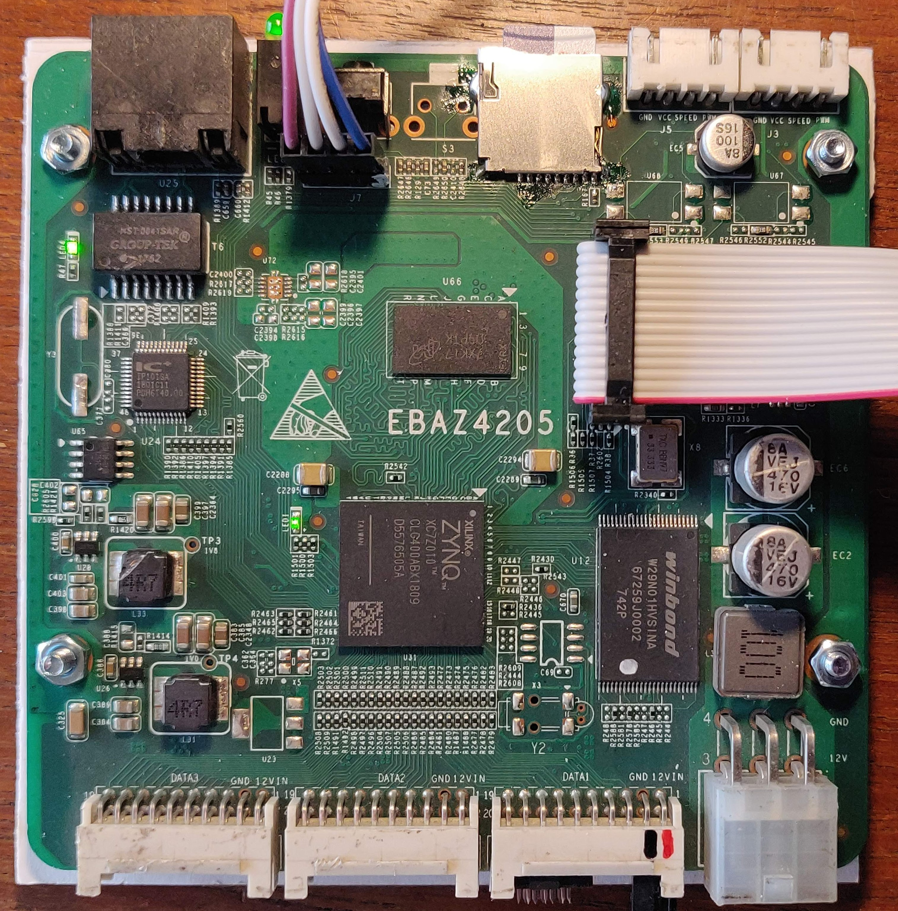

# EBAZ4205 nand

EBAZ4205 nand flash memory layout
Nand chip is W29N01HVSINA 128Mx8 1Gb

Note the board these files were saved from does not have the PHI 25MHz crystal installed, the PHI clock is fed from the FPGA from pin U18 via R1485, To use these files with a crystal then I suggest removing R1485 and adding the two 22pF capacators C377 and C380

The file in this directory 'nand' are copies of the original nand memory contents saved from within an SD version of linux using the following shell commands to an attached sdcard. Some of the saved files appear to be all blank, noted in list below.


## source
| Nand saved files                                        |
|---------------------------------------------------------|
| [dd if=/dev/mtd0ro of=/home/root/mtd0ro.bin](mtd0ro.bin)|
| [dd if=/dev/mtd1ro of=/home/root/mtd1ro.bin](mtd1ro.bin)|
| [dd if=/dev/mtd2ro of=/home/root/mtd2ro.bin](mtd2ro.bin)|
| [dd if=/dev/mtd3ro of=/home/root/mtd3ro.bin](mtd3ro.bin)|
| [dd if=/dev/mtd4ro of=/home/root/mtd4ro.bin](mtd4ro.bin)|
| [dd if=/dev/mtd5ro of=/home/root/mtd5ro.bin](mtd5ro.bin)|
| [dd if=/dev/mtd6ro of=/home/root/mtd6ro.bin](mtd6ro.bin)|
| [dd if=/dev/mtd7ro of=/home/root/mtd7ro.bin](mtd7ro.bin)|
| [dd if=/dev/mtd8ro of=/home/root/mtd8ro.bin](mtd8ro.bin)|


## layout


|dev: | address range               |  size    | erasesize| name              |filesize|used |
|-----|-----------------------------|----------|----------|-------------------|--------|-----|
|mtd0:|0x000000000000-0x000000300000|  00300000| 00020000 |"nand-fsbl-uboot"	 | 3.1 MB |     |
|mtd1:|0x000000300000-0x000000800000| 00500000| 00020000| "nand-linux"        |5.2 MB  ||
|mtd2:|0x000000800000-0x000000820000| 00020000| 00020000| "nand-device-tree"  |131.1 kB||
|mtd3:|0x000000820000-0x000001220000| 00a00000| 00020000| "nand-rootfs"       |10.5 MB |-all 0xff|
|mtd4:|0x000001220000-0x000002220000| 01000000| 00020000| "nand-jffs2"        |16.8 MB ||
|mtd5:|0x000002220000-0x000002a20000| 00800000| 00020000| "nand-bitstream"    |8.4 MB	 |-all 0xff|
|mtd6:|0x000002a20000-0x000006a20000| 04000000| 00020000| "nand-allrootfs"    |67.1 MB ||
|mtd7:|0x000006a20000-0x000007e00000| 013e0000| 00020000| "nand-release"      |20.8 MB |-all 0xff|
|mtd8:|0x000007e00000-0x000008000000| 00200000| 00020000| "nand-reserve"      |2.1 MB	 |-all 0xff|
|     |                             |          |          |                   |        |     |
|     |                             |          |          |                   |        |     |

## dumpimage
```
david@I7MINT:~/ebaz4205/nand$ dumpimage -l mtd0ro.bin 
Image Type   : Xilinx ZynqMP Boot Image support
Image Offset : 0x00001700
Image Size   : 0 bytes (98320 bytes packed)
PMUFW Size   : 98320 bytes (0 bytes packed)
Image Load   : 0x01010000
Checksum     : 0xfc164520
FSBL payload on CPU unknown (unknown):
    Offset     : 0xaa655598
    Size       : 2885681144 (0xabfffff8) bytes
    Load       : 0xeafffffeeafffffe
    Attributes : BigEndian AArch32 
    Checksum   : 0x00000000
Segmentation fault (core dumped)
david@I7MINT:~/ebaz4205/nand$ dumpimage -l mtd2ro.bin GP Header: Size d00dfeed LoadAddr 2b91
david@I7MINT:~/ebaz4205/nand$ dumpimage -l mtd3ro.bin GP Header: Size ffffffff LoadAddr ffffffff
david@I7MINT:~/ebaz4205/nand$ dumpimage -l mtd4ro.bin GP Header: Size 851901e0 LoadAddr 31000000
david@I7MINT:~/ebaz4205/nand$ dumpimage -l mtd5ro.bin GP Header: Size ffffffff LoadAddr ffffffff
david@I7MINT:~/ebaz4205/nand$ dumpimage -l mtd6ro.bin GP Header: Size 851902e0 LoadAddr 44100000
david@I7MINT:~/ebaz4205/nand$ dumpimage -l mtd7ro.bin GP Header: Size ffffffff LoadAddr ffffffff
david@I7MINT:~/ebaz4205/nand$ dumpimage -l mtd8ro.bin GP Header: Size ffffffff LoadAddr ffffffff
```

### extracted device tree source files

the binary files can be broken into part with a tool (forget which one now)

the dtc tool can be used to de-compile an existing device tree
```dtc -I dtb -O dts -o devicetree.dts devicetree.dtb```

The fsbl and devicetree files can have the dt extracted, here are the contents:
Device tree in [nand-fsbl-uboot](./mtd0-ftddump.txt)
Device tree in [nand-device-tree](./mtd2-ftddump.txt)


