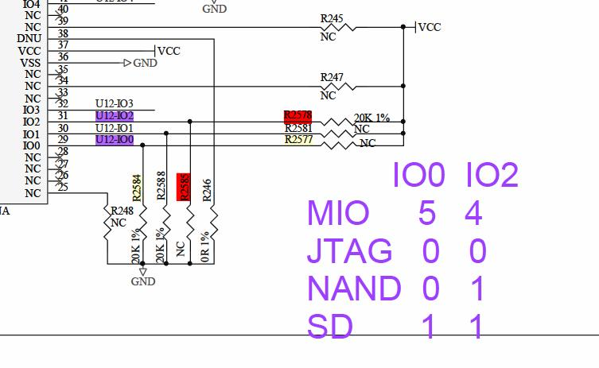
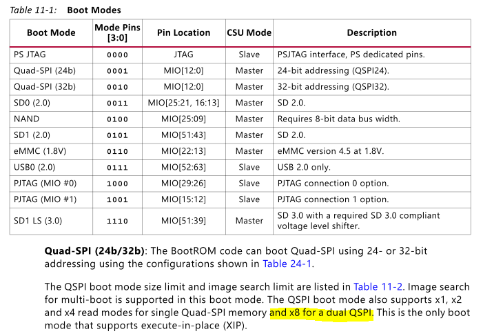
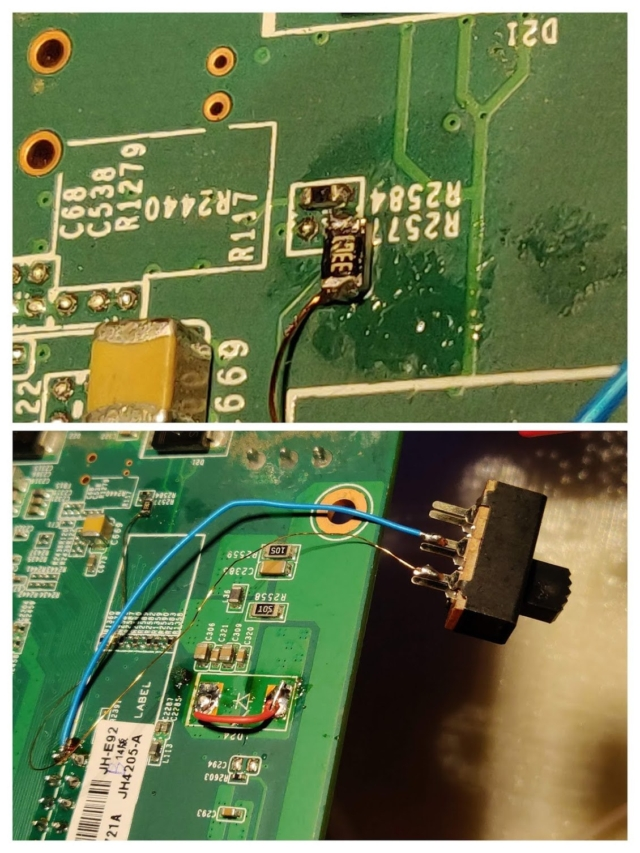

# EBAZ4205 petalinux

The xilinx bsp for zedboard is used as a base for petalinux with configuration added from the EBAZ4205 template here: https://github.com/DavidJRichards/EBAZ4205/raw/master/template/design_1_wrapper.xsa (path is ../../template in petalinux-config command )

zedbard bsp from here: https://www.xilinx.com/member/forms/download/xef.html?filename=avnet-digilent-zedboard-v2020.2-final.bsp

configuration changes:
location of saved tftp files changed to '/srv/tftpd/template'
local output files are in 'petalinux/template/images/linux/*' these can be copied to SD with new boot.scr in petalinux (todo: add changes to configuration)

Initial testing was performed using tftp from withing u-boot, the petalinux build has the atftpd default server directory added in the build config.

The default addresses used had to be changed since the ramdisk image was too large and spilled out into the dtb area, I moved the dtb from 0x2a0000 to 0x2c00000

booting fails unless bootcmd is amended, I neded to add 'debug memblock-debug systemd-unit=single' 
'systemd-unit=single' since removed without problem

Further testing done by copying files to FAT32 partition on micro SD card with custom boot.scr

A new bootscr is added to boot from SD card.
```
set bootargs 'debug memblock-debug systemd-unit=single console=ttyPS0,115200 rw earlyprintk earlycon loglevel=8  rootwait'
fatload mmc 0 0x3000000 uImage
fatload mmc 0 0x2C00000 system.dtb
fatload mmc 0 0x2000000 image.ub
bootm 0x3000000 0x2000000 0x2C00000
```
The contents of boot.cmd is compiled with mkimage to build boot.scr
```
mkimage -c none -A arm -T script -d boot.cmd boot.scr
```

## sample sd image
A bootable sd card image is included, it included two partitions, the first SD_BOOT is msdos formatted and includes the boot files. The second SD_EBAZ is in linux ext4 format and contains the Petalinux file system.

The image is created on an empty disk containing just these two names partitions using the shell script instal-sd.sh, if the ebaz4205 is configured to boot from sd card it should boot directly into linux. username root, password root.

DHCP is enabled to get IP address.

Various utilities are included including nano, mc, minicom, i2c-utils, locales (partial), make

Best results have been obtained using the tio terminal emulator.

[ebaz-4205-djrm-petalinux](http://djrm.netmx.co.uk/ebaz4205/ebaz-4205-djrm%20(2021-03-17%201532).img.zip)

## buildlog

```
david@I7MINT:~/Documents/GitHub/djrm-EBAZ4205/petalinux$ source /opt/petalinux/settings.sh
PetaLinux environment set to '/opt/petalinux'
WARNING: This is not a supported OS
INFO: Checking free disk space
INFO: Checking installed tools
INFO: Checking installed development libraries
INFO: Checking network and other services
warning, got bogus unix line.

david@I7MINT:~/Documents/GitHub/djrm-EBAZ4205/petalinux$ source ~/Xilinx/Vivado/2020.2/settings64.sh

david@I7MINT:~/Documents/GitHub/djrm-EBAZ4205/petalinux$ petalinux-create -t project -n template -s avnet-digilent-zedboard-v2020.2-final.bsp
INFO: Create project: template
INFO: New project successfully created in /home/david/Documents/GitHub/djrm-EBAZ4205/petalinux/template

david@I7MINT:~/Documents/GitHub/djrm-EBAZ4205/petalinux$ cd template

david@I7MINT:~/Documents/GitHub/djrm-EBAZ4205/petalinux/template$ 

david@I7MINT:~/Documents/GitHub/djrm-EBAZ4205/petalinux/template$ petalinux-config --get-hw-description=../../template  # xsa folder path
INFO: Sourcing build tools
INFO: Getting hardware description...
INFO: Rename design_1_wrapper.xsa to system.xsa
[INFO] Generating Kconfig for project
[INFO] Menuconfig project
*** End of the configuration.
*** Execute 'make' to start the build or try 'make help'.
[INFO] Extracting yocto SDK to components/yocto
[INFO] Sourcing build environment
[INFO] Generating kconfig for Rootfs
[INFO] Silentconfig rootfs
[INFO] Generating plnxtool conf
[INFO] Adding user layers
[INFO] Generating workspace directory

david@I7MINT:~/Documents/GitHub/djrm-EBAZ4205/petalinux/template$ petalinux-build
INFO: Sourcing build tools
[INFO] Building project
[INFO] Sourcing build environment
[INFO] Generating workspace directory
INFO: bitbake petalinux-image-minimal
WARNING: Host distribution "linuxmint-20.1" has not been validated with this version of the build system; you may possibly experience unexpected failures. It is recommended that you use a tested distribution.
Parsing recipes: 100% |#################################################################################################################################################| Time: 0:02:06
Parsing of 2995 .bb files complete (0 cached, 2995 parsed). 4265 targets, 204 skipped, 0 masked, 0 errors.
NOTE: Resolving any missing task queue dependencies
NOTE: Fetching uninative binary shim from file:///home/david/Documents/GitHub/djrm-EBAZ4205/petalinux/template/components/yocto/downloads/uninative/9498d8bba047499999a7310ac2576d0796461184965351a56f6d32c888a1f216/x86_64-nativesdk-libc.tar.xz;sha256sum=9498d8bba047499999a7310ac2576d0796461184965351a56f6d32c888a1f216
WARNING: Your host glibc verson (2.31) is newer than that in uninative (2.30). Disabling uninative so that sstate is not corrupted.
Initialising tasks: 100% |##############################################################################################################################################| Time: 0:00:03
Checking sstate mirror object availability: 100% |######################################################################################################################| Time: 0:00:17
Sstate summary: Wanted 976 Found 679 Missed 297 Current 0 (69% match, 0% complete)
NOTE: Executing Tasks
NOTE: Setscene tasks completed
NOTE: Tasks Summary: Attempted 3513 tasks of which 692 didn't need to be rerun and all succeeded.
Summary: There were 2 WARNING messages shown.
INFO: Successfully copied built images to tftp dir: /srv/tftp/template
[INFO] Successfully built project
david@I7MINT:~/Documents/GitHub/djrm-EBAZ4205/petalinux/template$ 
```
## create BOOT.BIN

```
avid@I7MINT:~/Documents/GitHub/djrm-EBAZ4205/petalinux/template$ petalinux-package --boot  --force --fsbl ./images/linux/zynq_fsbl.elf --fpga ./images/linux/system.bit --u-boot
INFO: Sourcing build tools
INFO: File in BOOT BIN: "/home/david/Documents/GitHub/djrm-EBAZ4205/petalinux/template/images/linux/zynq_fsbl.elf"
INFO: File in BOOT BIN: "/home/david/Documents/GitHub/djrm-EBAZ4205/petalinux/template/images/linux/system.bit"
INFO: File in BOOT BIN: "/home/david/Documents/GitHub/djrm-EBAZ4205/petalinux/template/images/linux/u-boot.elf"
INFO: File in BOOT BIN: "/home/david/Documents/GitHub/djrm-EBAZ4205/petalinux/template/images/linux/system.dtb"
INFO: Generating Zynq binary package BOOT.BIN...


****** Xilinx Bootgen v2020.2
  **** Build date : Nov 15 2020-06:11:24
    ** Copyright 1986-2020 Xilinx, Inc. All Rights Reserved.


[INFO]   : Bootimage generated successfully

INFO: Binary is ready.
```

## copy files to SD card

copy these files onto an SD card formatted as FAT32 to boot the ebaz board - the system must be configured for SD card booting with the correct boot option links set. 

| SD card files   |
|-----------------|
|[BOOT.BIN](./template/images/linux/BOOT.BIN)|
|[boot.scr](./boot.scr)|
|[uImage](./template/images/linux/uImage)|
|[system.dtb](./template/images/linux/system.dtb)|
|[image.ub](./template/images/linux/image.ub)|




The meaning of these options is shown in the table below



A simple modification to enable switching between nand boot and sd-card boot is to wire a switch and 3k3 resistor in series between IO0 (MIO5) and Vcc (3v3) with R2585 left in place.



## use SD partition for root FS

An SD partition formatted as ext4 may be used for the root FS, the neccessary files are created during the petalinux-build process. A modification to the boot command is needed to change the location of the rootfs, example:

```
set bootargs 'debug memblock-debug console=ttyPS0,115200 root=/dev/mmcblk0p2 rw earlyprintk earlycon loglevel=8 rootfstype=ext4 rootwait'
fatload mmc 0 0x3000000 uImage
fatload mmc 0 0x2C00000 system.dtb
bootm 0x3000000 - 0x2C00000
```

The partition can be created ising disks, gparted, fdisk etc
the ext4 partition will need to have the files in the generated archive added.
mount the partition in the build system and extract the file archive, e.g.

```
cd /media/david/EBAZ_FS
sudo tar ./xvf ./images/linux/rootfs.tar.gz
```

## How to add mc to petalinux image

The first thing I do on a new system is to install midnight commander (mc) to allow easy navigation of the file system and use use its editor (insted of vi)
mc is not available in the petalinux-config meus by default and I had to find a way to enable it Thanfully it turns out that it wasnt too difficult.
I found an example here: https://forums.xilinx.com/t5/Embedded-Linux/Midnight-Commander-for-Petalinux/td-p/1058820
on my ststem I edited ./project-spec/meta-user/conf/petalinuxbsp.conf and added 'IMAGE_INSTALL_append = mc' as a new line at the end of the file.

Afterwards the new option to install mc appeared in the menu 'petalinux-config -c rootfs' Filesystem Packages ---> console ---> utils ---> mc ---> [*] mc

Then save the configuration < Save > and rebuild the binaries using 'petalinux-build' to make the new FS.

note: when using mc from the serial terminal there is a problem with the line drawing characters, a workaround is to start mc with the command line option --stickchars, or -a This is not needed when using ssh, the full colour display with proper line drawing is then seen.

Latest version when used with tio serial terminal displays line drawing characters without any problems.

## Enviorenment variables

changes to the default enviorenment with script to source at startup.

```
root@ebaz-4205-djrm:~# cat set-env
#!/bin/bash
echo setting LS_OPTS
export LS_OPTS='--color=auto'
alias ls='ls ${LS_OPTS}'
echo setting colour terminal
export TERM=xterm-color
echo setting library path
export LD_LIBRARY_PATH=/ellcc/libecc/lib/arm32v6-linux

root@ebaz-4205-djrm:~# source ./set-env
setting LS_OPTS
setting colour terminal
setting library path
root@ebaz-4205-djrm:~# 
```

## i2c connections

PS7 configuration for I2C driver


## rtc device tree additions (wip)

/home/david/Documents/GitHub/djrm-EBAZ4205/petalinux/template/project-spec/meta-user/recipes-bsp/device-tree/files/system-conf.dtsi

```
/include/ "system-conf.dtsi"
/ {

		i2c@e0004000 {
         rtc@51 {
             compatible = "nxp,pcf8563";
             reg = <0x00000051>;
         };
		};

};
```

## rtc commands
Havn't managed to get the clock device created automatically, something needed in the device tree I expect. The parts are all working though.  

1) setup the clock from internet time.
```
# initial setup
# create rtc device
echo pcf8563 0x51 > /sys/class/i2c-adapter/i2c-0/new_device
# get time from time server
rdate  -s  time.nist.gov
# update clock chip
hwclock -w
```

2) read system time from clock chip
```
# subsequent setup
# create rtc device
echo pcf8563 0x51 > /sys/class/i2c-adapter/i2c-0/new_device
# set system time from clock chip
hwclock -s
```
RTC connections to PCB


# savenv to mmc

changes to the u-boot configuration can be made to enable u-boot enviorenment to be saved and loaded form sd-card.

the u-boot configuration is invoked and the menu items amended as shown below:


Commands to edit and rebuild an existing petalinux with new u-boot settings:

```
cd ~/Documents/GitHub/djrm-EBAZ4205/petalinux/template
source /opt/petalinux/settings.sh 
petalinux-config -c u-boot
petalinux-build -c u-boot
petalinux-build
./install-sd.sh
```

saving environment:
```
Hit any key to stop autoboot:  0 
Zynq> saveenv
Saving Environment to FAT... OK
```

reload at next boot: 

```
U-Boot 2020.01 (Apr 11 2021 - 09:51:56 +0000)

CPU:   Zynq 7z010
Silicon: v3.1
Model: Zynq Zed Development Board
DRAM:  ECC disabled 256 MiB
Flash: 0 Bytes
NAND:  128 MiB
MMC:   mmc@e0100000: 0
Loading Environment from FAT... OK
In:    serial@e0001000
Out:   serial@e0001000
Err:   serial@e0001000
Net:   
ZYNQ GEM: e000b000, mdio bus e000b000, phyaddr 0, interface gmii
eth0: ethernet@e000b000
Hit any key to stop autoboot:  0
```


rtc console session

```
PetaLinux 2020.2 ebaz-4205-djrm /dev/ttyPS0
ebaz-4205-djrm login: root
Password: 
root@ebaz-4205-djrm:~# i2cdetect 0
Warning: Can't use SMBus Quick Write command, will skip some addresses
WARNING! This program can confuse your I2C bus, cause data loss and worse!
I will probe file /dev/i2c-0.
I will probe address range 0x03-0x77.
Continue? [Y/n] 
     0  1  2  3  4  5  6  7  8  9  a  b  c  d  e  f
00:                                                 
10:                                                 
20:                                                 
30: -- -- -- -- -- -- -- --                         
40:                                                 
50: -- 51 -- -- -- -- -- -- -- -- -- -- -- -- -- -- 
60:                                                 
70:                                                 
root@ebaz-4205-djrm:~# date
Mon Mar  1 18:03:28 UTC 2021
root@ebaz-4205-djrm:~# hwclock
hwclock: can't open '/dev/misc/rtc': No such file or directory
root@ebaz-4205-djrm:~# echo pcf8563 0x51 > /sys/class/i2c-adapter/i2c-0/new_device
rtc-pcf8563 0-0051: registered as rtc0
i2c i2c-0: new_device: Instantiated device pcf8563 at 0x51
root@ebaz-4205-djrm:~# hwclock
Mon Apr 12 17:47:01 2021  0.000000 seconds
root@ebaz-4205-djrm:~# hwclock -s
root@ebaz-4205-djrm:~# date
Mon Apr 12 17:47:55 UTC 2021
root@ebaz-4205-djrm:~# 
```

### enable clock at boot

Automatic execution of rtc device cretaion and clock setting at system boot
(cludge shouldn't be neccessary)

create file /etc/init.d/makertc.sh

```
echo --- running makkertc.sh from init.d ---
echo pcf8563 0x51 > /sys/class/i2c-adapter/i2c-0/new_device
```

make file executable
chmod +x /etc/init.d/makertc.sh

create link to new file
ln -s /etc/init.d/makertc.sh /etc/rc.5/S10makertc


