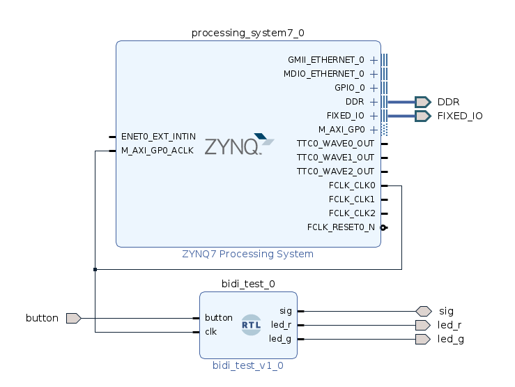

# Bidirectional I/O pin demo

Bidirectional i/o pins are needed for some protocol drivers, implementation details were not clear and much experimentation was needed to get a usable result.

The essence as a verilog example is as shown below:

```
// pin sig is the bidirectional input output pin
// output led is connected from bidirectional output to gnd via resistor
// input switch is connected to bidirectional input using led/resistor as pullup

// test vectors:
// assign sig_T = 0; // green led flashes as cnt[22] ok  (red led on)
// assign sig_T = 1; // green led follows input switch ok (red led off)

// button sets value of sig_T, 
// button selects output (0) when pressed
// button selects input (1) when released
// red led is on button pressed and when i/o is output 
```



```
module bidi_test(
    inout sig,
    output led_r,
    output led_g,
    input button,
    input clk
    );

wire sig_I;
wire sig_O;
reg sig_T;
reg [23:0] cnt;

IOBUF #(
    .DRIVE(12), // Specify the output drive strength
    .IBUF_LOW_PWR("TRUE"), // Low Power - "TRUE", High Performance = "FALSE"
    .IOSTANDARD("LVCMOS33"), // Specify the I/O standard
    .SLEW("SLOW") // Specify the output slew rate
    ) sig_IOBUF (
    .I(sig_O), // Buffer output
    .IO(sig), // Buffer inout port (connect directly to top-level port)
    .O(sig_I), // Buffer input
    .T(sig_T) // 3-state enable input, high=input, low=output
);

assign led_r = sig_T;
assign led_g = ~sig_I;      // active when sig_T is 1
assign sig_O = cnt[22];     // active when sig_T is 0

initial begin
    cnt = 0;
end

always @(posedge clk)
begin
    sig_T <= button;
    cnt<=cnt+1;
end

endmodule
```