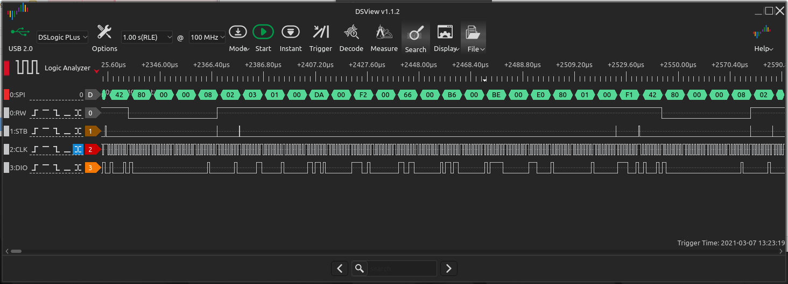
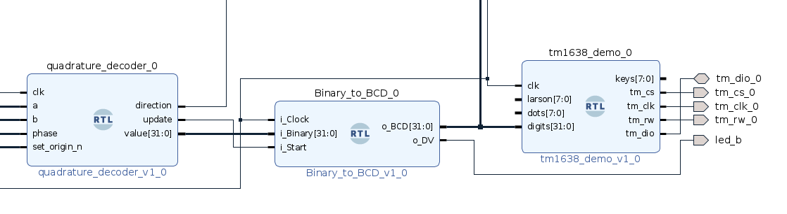

# TM1639 LED & Button driver

A test project was built to explore the requirements of the IOBUF component, the findings applied to this project and now input and output are working as expected.

The demo PL application does successive reads and writes of all buttons and leds, If a button is pressed the corresponding number is replaced by a DP.

[TM1638-Demo.mp4](./TM1638-Demo.mp4)

The code is an adaption of an example here: [tm1638-verilog](https://github.com/alangarf/tm1638-verilog)

A LA Frame showing all the input and output requests is shown below, in this example the first and last buttons is pressed, shown as the read sequence 0x80, 0x00, 0x00, 0x08.

Although not needed for the protocol the read/write signal is also exposed in this demo - it was needed during development testing and may now be removed.

## Encoder

The display is now driven from a binary to BCD decoder, fed from the output of a rotary encoder.

[Encoder-Demo.mp4](./Encoder-Demo.mp4)

