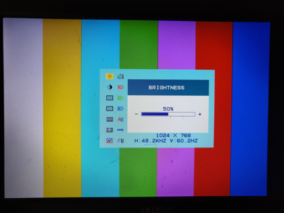

## Initial test using VGA DAC ADV7123

To set the screen resolution the appropriate set of constants are selected in file [VGA_CTRL.v](./VGA_TEST.srcs/sources_1/new/VGA_CTRL.v) by un-commenting the required sections.

The pixel clock needs to be configured to match the selected screen resolution, in the supplied example it is set to 65MHz, this is derived from the Zinq clock using a PLL. Note the input to the PLL appears to be 125MHz when booted from the default nand configuration (frequency found by expeiment)

The PLL is also used to generate the ethernet phi clock of 25MHz, (other ethernet ports no implemented, todo)

The green LED flashes at about 2Hz when VGA is being output (always).

There is a GPIO switch input attached to Zinq pin H16 (data 1 pin 5) it is fed back to the Red LED.
