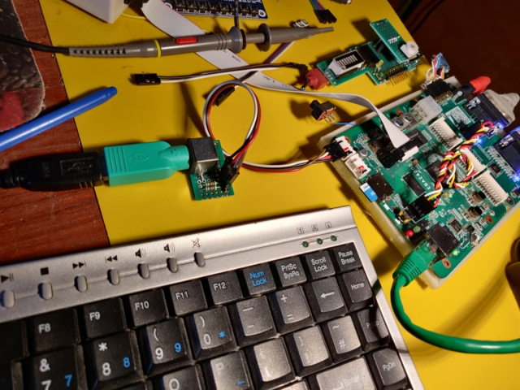
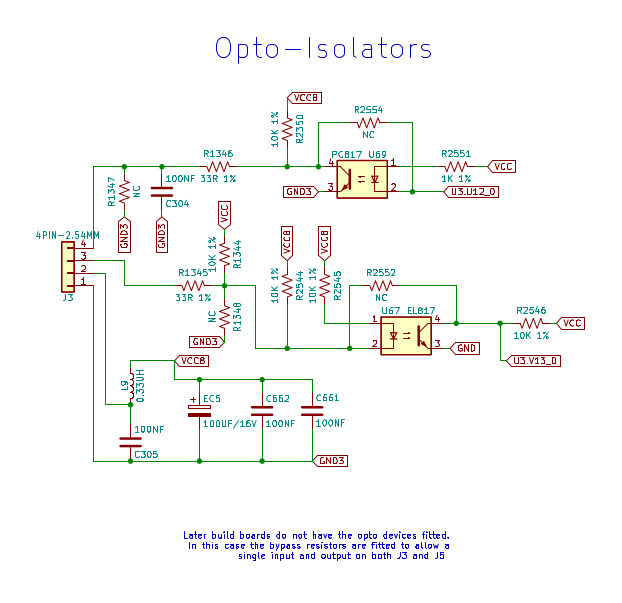

# PS/2 Keyboard

Interfacing a PS/2 keyboard to FPGA PL GPIO

## Ebaz4205 interface

Most ebaz4205 boards are supplied without the opto-isolators fitted and the fan inteface may be used like any other PL GPIO pins. The power pin on the fan connector is fed from the VCC8 power through a LC filter circuit. VCC8 is the power fed into the nominally 12V input J4. I have 5 Volts on this connector - **Do NOT feed 12 volts into your keyboard**. Because I am feeding power into the Data2 connector I have had to short out D24. This has the possibly beneficial side effect or restoring the power supply capacators EC2 and EC6 into the circuit.

The fan interface includes current limiting resistors of 33R in series with the data pins, there are also pull ups of 10K to VCC8. One of the data connections (pin4) also has a 100n capacator (C304, C333) to ground. To use the circuit with fast switching data then this must be removed.

|Ref |Name|Pin|Comment|
|----|----|---|-------|
|J5-1|Fan 0 -|Gnd||
|J5-2|Fan 0 +|VCC8||
|J5-3|Fan 0 0|V15||
|J5-4|Fan 0 1|V12||
||
|J3-1|Fan 1 -|Gnd||
|J3-2|Fan 1 +|VCC8||
|J3-3|Fan 1 0|V13||
|J3-4|Fan 1 1|U12||
||

## PL Constraints

These settings have been used to implement the keyboard in a PL design, the pull-up settings are not needed in this circuit but do no harm.

```
\##################################
\# J3, PS2 interface
\##################################
set_property PACKAGE_PIN V13 [get_ports {PS2_Data_0_tri_io}]
set_property PULLUP true [get_ports {PS2_Data_0_tri_io}]
set_property IOSTANDARD LVCMOS33 [get_ports {PS2_Data_0_tri_io}]

set_property PACKAGE_PIN U12 [get_ports {PS2_Clk_0_tri_io}]
set_property PULLUP true [get_ports {PS2_Clk_0_tri_io}]
set_property IOSTANDARD LVCMOS33 [get_ports {PS2_Clk_0_tri_io}]
```





## Software

There is an PS2 to AXI inteface available here: [axi-ps2](https://github.com/Digilent/vivado-library/tree/master/ip/axi_ps2_1.0)

The library can be installed together with other pmod components by including the full vivado library, the ps2 axi interface specification is is the document here: [AXI PS/2 1.0 IP Core User Guide](https://github.com/Digilent/vivado-library/raw/master/ip/axi_ps2_1.0/doc/AXI%20PS2.pdf)


## Digilent Pmod PS2

The ready made Pmod PS2 from digilent also uses a passive level translation of the keyboard data pins, but in this case 220R series resistors are used (as apposed to the 33R resistors in the fan interface)

[reference-manual](https://reference.digilentinc.com/reference/pmod/pmodps2/reference-manual)

[pmodps2_sch](https://reference.digilentinc.com/_media/reference/pmod/pmodps2/pmodps2_sch.pdf)
